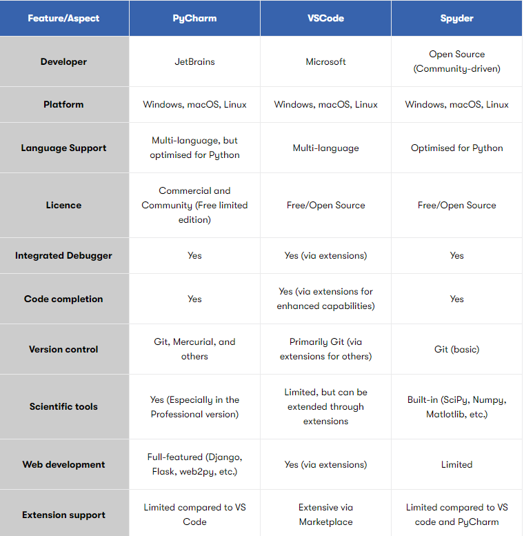

# Topic 4 - Data Structures and OOP - 19/12/2024

## Getting started with Python

**IDEs**
**Visual Studio Code (VSCode)**
Microsofts Product. Good all rounder

**PyCharm**
PyCharm is a Python-focused IDE with a rich feature set for professional development, including debugging and version control. It's heavier on system resources compared to VSCode but provides a more out-of-the-box, Python-optimised experience.

Difference from VSCode: PyCharm offers an all-in-one solution tailored specifically for Python development, requiring less configuration and extension installation compared to the more general-purpose VSCode.

**Spyder**
Spyder is an IDE primarily geared towards scientists and data analysts, featuring built-in support for scientific Python libraries. It has an interactive console and variable explorer ideal for data manipulation and analysis. It’s typically packaged with Anaconda. 

While VSCode is extensible and supports multiple languages, Spyder is specifically optimised for scientific computing in Python, offering features like a variable explorer that are less common in general-purpose editors like VSCode.

**Jupyter Notebook**
Web application. Gives more of a front end to see the code running or display graphs etc.

### Exploration of Anaconda

Instead or even alongside your IDE, you can use one of the most popular data science distributions, Anaconda. But what is Anaconda?

Well, Anaconda is a popular distribution for Python and R that simplifies package management and deployment. It comes pre-loaded with numerous libraries and includes Conda, a tool for easy package and environment management. Anaconda helps data scientists work more efficiently across tasks such as data manipulation, visualisation, and machine learning. 

**Jupyter Notebooks** (packaged with Anaconda) are excellent for data science and interactive computing because they allow for real-time code execution, visualisation, and data analysis in a single, easily shareable document, facilitating iterative development and enabling clear documentation of methodologies and insights.

## Introduction to Data Structures

In Python, data structures help us store and manage multiple pieces of information in an organised manner. Imagine you need to store a list of names. You could use individual variables for each, like name1, name2, etc., but that's impractical and error-prone. A better approach is using data structures like lists to hold all names collectively. 

### Fundamental Data Types

**Integers**
These are whole numbers that can be positive, negative, or zero. They do not have a decimal point. Examples include -2, -1, 0, 1, 2, and so on

**Floats**
These are numbers that have a decimal point. They can represent real numbers, which include both whole numbers and fractions. Examples include -2.5, -1.0, 0.0, 0.5, 1.0, 2.2, and so on. Floats can represent a wider range of values than integers, with greater precision

**Strings**
Store sequences of characters and are wrapped in quotes: 'Hello'

**Booleans**
Booleans (bool) store either True or False.

### Non-Fundamental Data Types

**Lists**
Lists are ordered, changeable collections that can store different types of items. [1,2,3,4]

**Tuples**
Tuples are like lists but are immutable, meaning their elements cannot be changed. (1,"apple", 3.5

Tuples are like lists but are immutable, meaning their elements cannot be changed. There is a silly benefit and an important benefit to tuple’s immutability. 

The silly benefit is that code that uses tuples is slightly faster than code that uses lists. (Python is able to make some optimisations knowing that the values in a tuple will never change.) But having your code run a few nanoseconds faster is not important.

The important benefit to using tuples is similar to the benefit of using constant variables: it’s a sign that the value in the tuple will never change, so anyone reading the code later will be able to say, "I can expect that this tuple will always be the same. Otherwise the programmer would have used a list." 

This also lets a future programmer reading your code say, "If I see a list value, I know that it could be modified at some point in this program. Otherwise, the programmer who wrote this code would have used a tuple."

**Dictionaries**
Dictionaries hold key-value pairs and are incredibly versatile. Here is an example: {'name#: 'Johnm', 'age': 30}

*A note on Identifiers*

Identifiers are the names we give to variables (and also to collections, functions, classes, etc.). There are rules for naming identifiers:

- Must start with a letter or an underscore (_).
- Cannot start with a number.
- Can only contain alphanumeric characters and underscores.

For example, **my_number** is a valid identifier, but **1my_number** is not.

## Lists and Dictionaries

### Lists
A list in Python is an ordered collection of items that can contain elements of mixed types.

Unlike basic data types, lists allow us to hold multiple items in a single structure, making it easier to perform operations on them as a group. 

The features of lists include:

- Ordered - The items have a specific, consistent order
- Mutable - Lists can be altered even after their creation

### When and when to use lists

Use lists when:

**Order matters**
- Lists keep your elements in the order you added them.

**Duplicates allowed**
Lists allow duplicate items.

**Dynamic changes**
You need a collection that you can modify (add, remove, change items).

### Why and when to use Dictionaries

A dictionary in Python is an unordered collection of key-value pairs.

Imagine you are building a contact book where you want to store multiple details for each person—like their phone number, email, and address. 

Using a list would be cumbersome. This is where dictionaries come in handy, as they allow us to store key-value pairs.

The features of dictionaries include:

- Key-Value Pair: Items are stored as 'key' and 'value' combinations
- Fast Lookups: Excellent for retrieving data quickly

Use dictionaries when:

**Key-Value Pairs**
- You have a set of unique keys that map to specific values.

**Lookup Table**
Quick data retrieval is essential.

**Dynamic changes**
You want the flexibility to add or remove key-value pairs.

### Collections vs Data Structures

**Collections** in Python are containers that are used to store multiple elements, such as lists, sets, dictionaries, and tuples. **Data Structures**, on the other hand, are a broader concept that includes collections but also encompasses other ways of organising and storing data, such as arrays, linked lists, trees, and graphs.

**Advanced Python collections**

Python, as a versatile and powerful programming language, offers a variety of advanced collections that provide robust functionality and flexibility for handling data. This section delves into these advanced collections, exploring their definitions, examples of their usage.

### Sets
**Definition:** A set is an unordered collection of unique elements.

**Use Cases:** Sets are useful for membership testing, eliminating duplicate entries, and performing mathematical set operations like union, intersection, and difference.

**Example:** 

unique_numbers = {1,2,3,4}

### Frozen Sets
**Definition:** A frozenset is an immutable version of a set, meaning its elements cannot be changed after creation.

**Use Cases:** Frozensets are used in situations where a set's immutability is required, such as keys in dictionaries.

**Example:** 

frozen_unique_numbers = frozenset([1,2,3,4])

### Named Tuples
**Definition:** Named tuples are an extension of the regular tuple that allows you to name the elements, improving code readability.

**Use Cases:** Named tuples are ideal for cases where you need tuples but also want to access elements by name rather than index.

**Example:** 

from collections import namedtuple 

Point = namedtuple('Point', ['x','y']) p = Point(1,2)

### OrderedDict
**Definition:** An OrderedDict is a dictionary that maintains the order of items based on insertion order.

**Use Cases:** OrderedDicts are beneficial when the order of items is important, such as in LRU (Least Recently Used) caches.

**Example:** 

from collections import OrderedDict 

od = OrderedDict() 
od['a'] = 1 
od['b'] =2

## Data serialisation and coding conventions

Data Serialisation is the process of converting data structures or objects into a format that can be stored or transmitted and then reconstructed later. Common formats for serialisation include JSON, XML, and binary formats.

### Benefits of data Serialisation

- **Data persistence:** Serialisation allows you to save the state of an object to a file or database, enabling long-term storage
- **Data exchange:** Serialisation enables data to be easily shared between different systems, platforms, or applications
- **Performance:** Serialised data can be efficiently transmitted over networks, reducing bandwidth usage and improving communication speed

### Serialisation Guide

**JSON (JavaScript Object Notation)**
**Definition:** JSON is a lightweight data interchange format that is easy for humans to read and write and easy for machines to parse and generate.
**Use Cases:** JSON is commonly used for web APIs, configuration files, and data exchange between different programming languages.
**Example:** 

python import json 

data = {'name': 'Alice', 'age': 25} 

json_str = json.dumps(data)

**Pickle**
**Definition:** Pickle is a Python-specific binary serialisation format that can serialise and deserialise Python objects.
**Use Cases:** Pickle is used for saving complex Python objects, such as models in machine learning, to disk.
**Example:** 

import pickle 

data = {'name': 'Alice', 'age': 25} 

with open('data.pkl', 'wb') as f: pickle.dump(data, f)

**XML (eXtensible Markup Language)**
**Definition:** XML is a markup language that defines a set of rules for encoding documents in a format that is both human-readable and machine-readable.
**Use Cases:** XML is used for configuration files, data interchange between systems, and web services.
**Example:** 

import xml.etree.ElementTree as ET 

data = ET.Element('data') 

name = ET.SubElement(data, 'name') 
name.text = 'Alice'

### Why coding conventitions matter

1. **Readability:** Consistent coding style makes code easier to read and understand, reducing the learning curve for new developers

2. **Maintainability:** Following conventions helps maintain a uniform codebase, making it easier to manage and update over time

3. **Collaboration:** Standardised code ensures that team members can easily collaborate, review, and contribute to projects

**Indentation**
**Definition:** Python uses indentation to define code blocks, and PEP 8 recommends using 4 spaces per indentation level.
**Details:** Consistent indentation is crucial for readability and avoiding syntax errors.

**Example:** 

def my_function():
    if true:
        print('Hello  world!')

**Line length**
**Definition:** Limit all lines to a maximum of 79 characters.
**Details:** Breaking long lines improves readability and prevents horizontal scrolling.

**Example:** 

def my_function():
    print('This is an example of a long line that should be broken into multiple lines for better readability')

**Naming conventions**
**Definition:** Use descriptive names for variables, functions, classes, and modules.
**Details:** Descriptive names enhance code clarity and make it self-documenting.

**Example:** 

variable_name = "value" 

def function_name():
    pass class

ClassName:
    pass

**Whitespace**
**Definition:** Use whitespace to improve readability, but avoid extraneous whitespace.
**Details:** Proper use of whitespace around operators, after commas, and before and after functions improves code readability.

**Example:** 

def my_function(param1, param2):
    return param1 + param2

**Comments**
**Definition:** Use comments to explain code and provide context, but keep them concise and relevant.
**Details:** Comments should be used judiciously to clarify complex logic or assumptions, not to state the obvious.

**Example:** 

'#' This function adds two numbers 
def add(a,d):
    return a + b

## Object-oriented programming (OOP) in Python

Did you know that Object-Oriented Programming (OOP) is a programming paradigm that can make your code more modular, reusable, and easier to maintain? Many of the most popular software applications are built using OOP principles.

### What is Object-Orientated Programming (OOP)?

Object-Oriented Programming (OOP) is a programming paradigm that uses objects and classes to structure software. Objects are instances of classes, which can contain both data (attributes) and methods (functions). OOP focuses on encapsulating data and behaviour within objects, promoting modularity and reusability. 

**Four pillars of OOP**
1. Encapsulation
2. Abstraction
3. Inheritence
4. Polymorphism

### Encapsulisation

**Definition:** Encapsulation bundles data (variables) and methods (functions) that operate on the data into a single unit (class). It restricts direct access to some parts of the object to maintain control and prevent accidental interference.

**Example:** A BankAccount class with private variables balance and methods deposit() and withdraw():

class BankAccount:
    def __init__(self):
        self.__balance = 0  # Private variable
    
    def deposit(self, amount):
        self.__balance += amount

    def withdraw(self, amount):
        if amount <= self.__balance:
            self.__balance -= amount
        else:
            print("Insufficient funds")

    def get_balance(self):
        return self.__balance

account = BankAccount()
account.deposit(100)
print(account.get_balance())  # Output: 100

### Abstraction

**Definition:**  Abstraction hides complex details and shows only the essential features of an object. It simplifies usage by providing a clear interface.

**Example:** A Car class with a simple interface to start() and drive(), hiding the internal details:

class Car:
    def start(self):
        print("Car engine started")

    def drive(self):
        print("Car is driving")
        
my_car = Car()
my_car.start()  # Output: Car engine started
my_car.drive()  # Output: Car is driving

### Inheritence

**Definition:** Inheritance allows a class (child) to inherit properties and methods from another class (parent). It promotes code reuse.

**Example:** A Dog class inherits from a Animal class:

class Animal:
    def eat(self):
        print("This animal eats food")

class Dog(Animal):  # Dog inherits from Animal
    def bark(self):
        print("Woof!")

dog = Dog()
dog.eat()  # Output: This animal eats food
dog.bark()  # Output: Woof!

### Polymorphism

**Definition:**  Polymorphism allows methods to have different implementations based on the object calling them. It means "many forms."

**Example:** A draw() method works differently for Circle and Rectangle classes:

class Shape:
    def draw(self):
        pass

class Circle(Shape):
    def draw(self):
        print("Drawing a Circle")

class Rectangle(Shape):
    def draw(self):
        print("Drawing a Rectangle")

shapes = [Circle(), Rectangle()]
for shape in shapes:
    shape.draw()
    # Output:
    # Drawing a Circle
    # Drawing a Rectangle

### Design patterns and their benefits

**Design Patterns** are typical solutions to common problems in software design. They represent best practices used by experienced developers to solve specific problems in a structured and efficient manner.

Example: **The singleton design pattern**

Singleton is one of the simplest and most commonly used design patterns. It ensures that a class has only one instance and provides a global point of access to it.

**Key Features**
1. Single Instance: Ensures only one instance of the class is created.
2. Global Access: Provides a way to access the single instance from anywhere in the code.
3. Controlled Instantiation: Restricts direct creation of objects from the class.

class Singleton:
    _instance = None  # Class-level variable to hold the single instance

    def __new__(cls, *args, **kwargs):
        if cls._instance is None:
            cls._instance = super().__new__(cls)  # Create the instance
        return cls._instance

# Usage
singleton1 = Singleton()
singleton2 = Singleton()

print(singleton1 is singleton2)  # Output: True (both refer to the same instance)

**Real world example: Logger**

class Logger:
    _instance = None

    def __new__(cls, *args, **kwargs):
        if cls._instance is None:
            cls._instance = super().__new__(cls)
            cls._instance.logs = []  # Initialize storage for logs
        return cls._instance

    def log(self, message):
        self.logs.append(message)

    def show_logs(self):
        return self.logs

# Usage
logger1 = Logger()
logger2 = Logger()

logger1.log("App started")
logger2.log("An error occurred")

print(logger1.show_logs())  # Output: ['App started', 'An error occurred']
print(logger1 is logger2)   # Output: True (same instance)

*Usefulness for data engineers*

*The Singleton pattern is particularly useful for managing resources such as database connections, configuration settings, or logging instances in data engineering projects. Ensuring a single instance of these resources prevents conflicts and reduces overhead.*

## Lecture Notes

## Topic 4 Reflections

